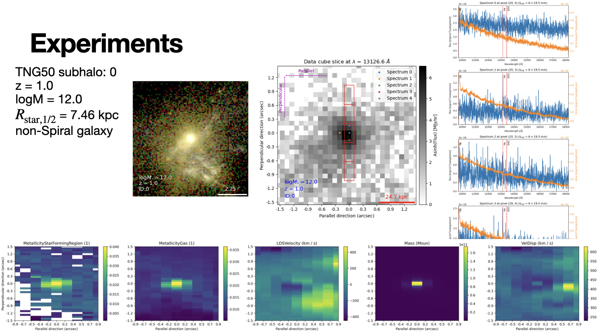
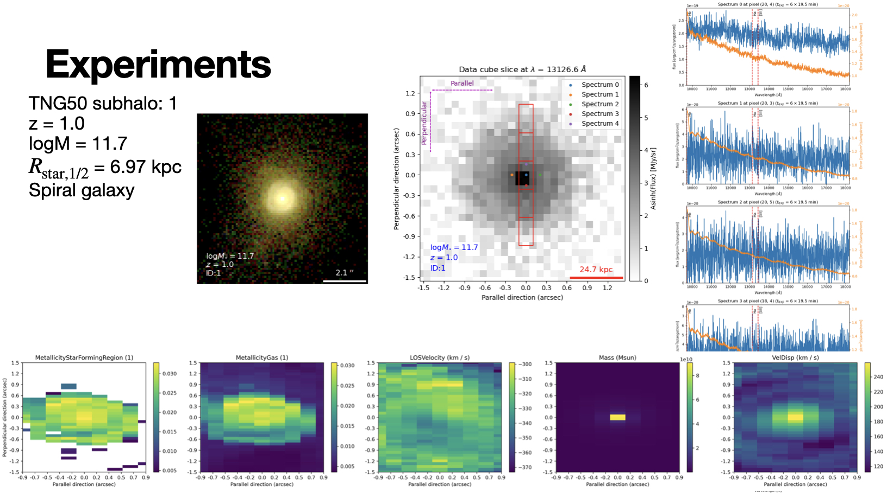

# galaxyGeniusMSA

The extension of galaxyGenius to calibrate the JWST MSA-3D observations. 

! Still under construction

## Preliminary results

## Dependence

Python == 3.11.10  

numpy  
tomlkit  
h5py  
astropy  
scipy  
numba  
scikit-image  
matplotlib  
matplotlib_scalebr  

and

illustris_python  
SKIRT  
stpsf  
jwst_backgrounds  
pyfftw (optional)  

## Usage
Usage will be documented when the codes are fully implemented. 