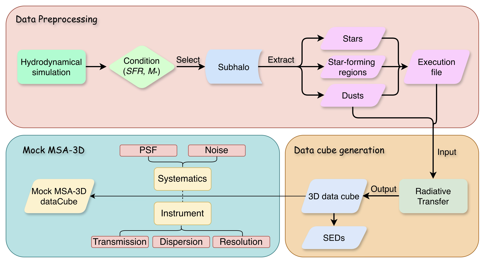
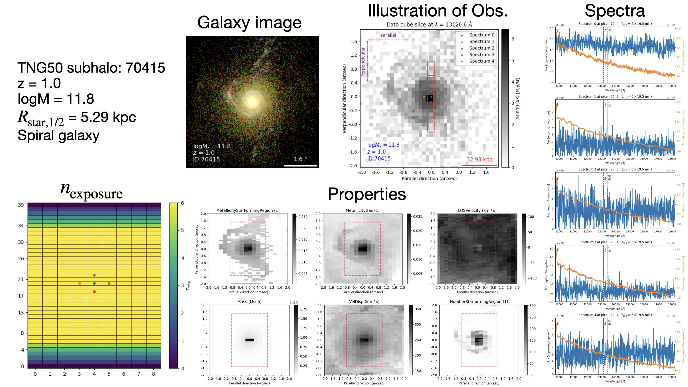
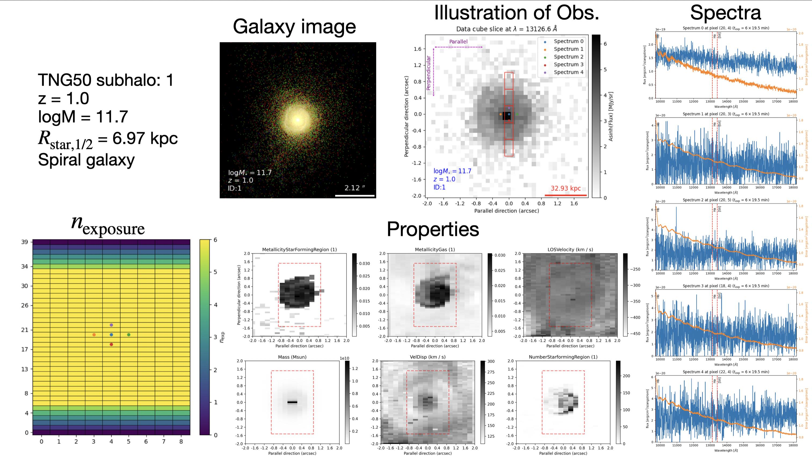
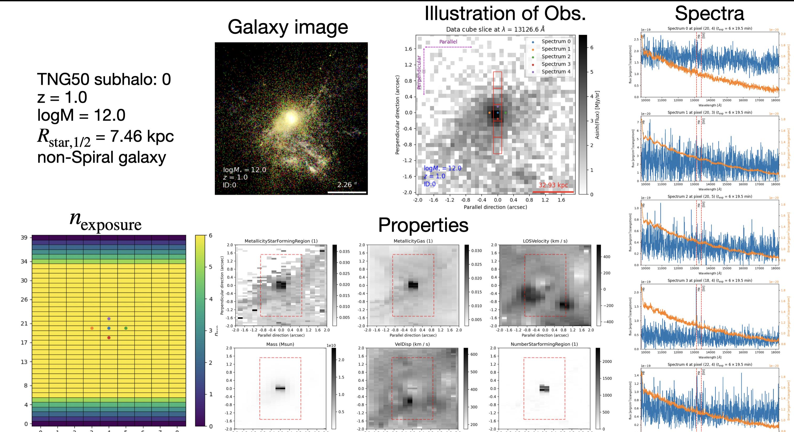

# galaxyGeniusMSA

JWST MSA-3D data simulation tool based on [galaxyGenius](https://github.com/xczhou-astro/galaxyGenius)  
Please refer to [this](https://jwst-docs.stsci.edu/jwst-near-infrared-spectrograph/nirspec-instrumentation/nirspec-micro-shutter-assembly#gsc.tab=0) website for more details on the JWST/NIRSpec Micro-Shutter Assembly (MSA) instrument.  
For the JWST MSA-3D project, please refer to [I. Barišić et al. 2025](https://iopscience.iop.org/article/10.3847/1538-4357/ada617) and [M. Ju et al. 2025](https://iopscience.iop.org/article/10.3847/2041-8213/ada150) for more details.  

## Workflow

## Results

The results for three subhalos (ID: 0, 1, 70415 for snapshot 50 of TNG50-1 simulation) are saved in `tutorial/MSA_mock/Subhalo_(ID)`:  
- `MSA_dataTensor.fits`: the simulated MSA data tensor, with shape (ny, nx, 4, nw), where ny and nx are spatial dimensions, 4 represents wavelengths, signals, noises and SEDs, and nw is the number of wavelengths.  
- `MSA_exposure.png`: the exposure map of the MSA simulation, showing the number of exposures for each pixel.  
- `MSA_observation.png`: the accumulated signal flux over all wavelengths for the data tensor.  
- `MSA_slitlets.png`: the illustration of mock observations, showing several MSA shutters over the target galaxy. Note that the pixel scale of overlapping galaxy image is 0.1 arcsec/pixel, corresponding to the pixel scale of NIRSpec detector.  
- `MSA_spectra.png`: several mock spectra in different pixels of the data tensor.  
- `True_properties.fits`: several true properties of the target galaxy in different pixels, including metallicity, mass, velocity dispersion, etc. These properties are employed for calibration of the MSA.  
- `True_properties.png`: the illustrations of the true properties.  

Additionally, we also provide the mock RGB image for each galaxy by F070W, F150W and F200W of JWST NIRCam for comparison. They are generated by [galaxyGenius](https://github.com/xczhou-astro/galaxyGenius) with pixel scale (0.031 arcsec/pixel) of the three filters.  

Other intermediate data (dataCubes from SKIRT and cached PSF cubes) are shared at [Google Drive](https://drive.google.com/drive/folders/1-efbNxXjDrCG2QY07KpZQgHFOcHqxqxU?usp=drive_link)

## Dependence

`Python==3.11`  

`tomlkit==0.13.2`  
`numpy==1.24.0`   
`scipy==1.14.1`  
`matplotlib==3.9.2`  
`matplotlib_scalebar==0.8.1`  
`astropy==7.0.0`  
`h5py==3.9.0`  
`scikit-image==0.24.0`  
`requests==2.32.3`  
`numba==0.63.1`  
`rocket_fft==0.3.1`  

and

[SKIRT](https://skirt.ugent.be/root/_home.html)  
[illustris_python](https://github.com/illustristng/illustris_python)  
[stpsf](https://stpsf.readthedocs.io/en/latest/#)  
[jwst_backgrounds](https://github.com/spacetelescope/jwst_backgrounds)  

Notes:  
illustris_python: read subhalos from TNG snapshots.  
stpsf: generate PSFs of JWST instrument.  
jwst_backgrounds: generate background noise curve of JWST instrument.  

## Installation 

Firstly, please install SKIRT following the [installation guide](https://skirt.ugent.be/root/_installation_guide.html).  

Secondly, please create a new conda environment and install galaxyGeniusMSA by:  
`conda create -n galaxyGenius python=3.11`  

`conda activate galaxyGenius`  

`pip install .`  
This will install all the Python dependencies and precompile all the functions decorated with numba.  
Please set the `GALAXYGENIUS_DATA_DIR` environment variable in `~/.bashrc` to the path of the `Data` directory, or set it in the python script by `os.environ['GALAXYGENIUS_DATA_DIR'] = '/path/to/Data'`.  

## Usage
Please refer to `tutorial/pipeline.py` for an example.  
For more details on configurations in `config.toml` and `config_MSA.toml`, and other usage, please refer to [documentation](https://xczhou-astro.github.io/galaxyGenius-MSA/) and `notebook/usage.ipynb`.  

To include more truth properties, please refer to `tutorial/moreTruthProperties.py` for detailed description.

## Other scripts

`download_subhalos.py`: a useful script to download subhalos from TNG simulation by Web-based API. Particle data of desired subhalos can be downloaded instead of the entire snapshot. Please refer to the [website](https://www.tng-project.org/data/) for more details and register an account to obtain an API key.  

`precompile_numba_functions.py`: To accelerate postprocessing, some functions are decorated with [numba](https://numba.pydata.org/). They require compilation at first run, this script precompiles all numba functions to initialize and cache them, which can be used in subsequent runs. If you install galaxyGeniusMSA by `pip install .`, the `precompile_numba_functions.py` will be executed automatically. Otherwise, you can manually run it by `python precompile_numba_functions.py`.  

`tutorial/imageSimulation.py`: A script to simulate galaxy images by JWST NIRCam (0.031 arcsec/pixel) of a subhalo using galaxyGenius. Please be sure that [galaxyGenius](https://github.com/xczhou-astro/galaxyGenius) is downloaded.  
